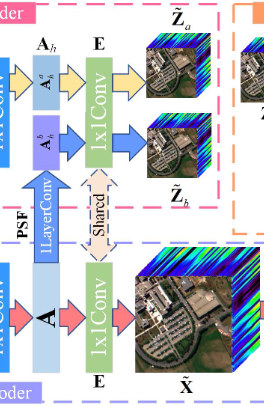

- [x] The dimension of Convolution Layers:
  - I am not sure about the dimensions of conv nets.  
  
  - [x] First about, the images. We have images "Z" that are m x n x L, what we should do to apply the convolution layer? 

  Hyphotesis: 

    We transform the image in a  2D vector, (mn x L) with it'll apply the convolution layer like: Conv2D(mn, hidden_size, (1,1)), why? I don't know.
  
  Answer:
      The input of a convolution layer is the number of channels, it means the number of bands for HSI image.

  - [x] Ok, after, how about the endmembers conv layer? We can see in the article that it'll receive as entry the "A" matrix, that will be if Ah (mn x p) or if A (MN x p), and the output will be or Za (mn x L) or X (MN x L).
  
    

  Hyphotesis: 

    The endmember conv layer have to transform the last dimension "p", it's the number of endmembers, into the number of bands "L". 

Maybe this sentence from the article can help us. 

    "The dimension of the endmembers conv layer is px1x1xL where px1x1 is the kernel and L the number os kernels. "p" is the number of endmembers. For the case of indian pines dataset, p = 16."

  - [x] How about PSF layer?

        "The PSF, a convolution layer with 1 input channel and 1 output channel is implemented for every band of the abundance A."  

---

- [ ] PSF and SRF conv layers have the bias setted to off?

- [ ] How to obtain the HrMSI data?

  Hypothesis: 
    - The dataset that we have is already with HrHSI images, so we apply SRF to obtain HrMSI images.
        "To simulate the HrMSI, the SRF for the blue to SWIR2 bands of the Landsat 8 were used" from Implementation Details pg. 6
    - We can found it on the internet as a dataset like we found the HSI dataset. 
